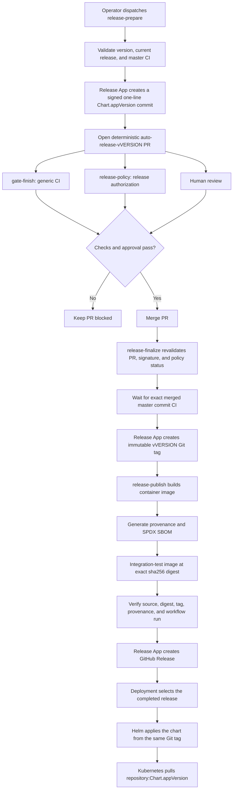

# ADR-001: Release Process

## Status

Accepted

## Context

The previous release process was tag-first:

1. A person created a `v*` Git tag.
2. The release workflow built and pushed the final container tag.
3. The workflow opened a Helm pull request that changed `Chart.appVersion`.
4. Merging that pull request created the GitHub Release.

Consequently, release publication began before review, the Git tag pointed to
source that did not contain the resulting Helm version, and the final image was
not integration-tested by its immutable digest. Version extraction from the
pull-request title could also lose SemVer prerelease information.

The release process must provide one auditable relationship between reviewed
source, Helm metadata, the Git tag, the container image, and the GitHub Release.
Normal CI health and release authorization must remain separate decisions.

## Decision

Releases are PR-first and forward-only. A release is prepared as a signed,
one-line Helm metadata pull request. The immutable Git tag is created only after
that pull request is reviewed, merged, and the exact merge commit passes the
`master` CI workflow. The tagged source then builds and verifies the release
artifact before a GitHub Release is published.

The release pipeline publishes a deployable artifact; it does not directly
modify a Kubernetes environment. Deployment is a separate operator or
environment-automation action that consumes a completed GitHub Release.

### Version identity

`Chart.appVersion` is the canonical human-readable release version. The same
value is used without transformation everywhere:

| Object | Example |
| --- | --- |
| Helm `Chart.appVersion` | `v1.2.3-build.7` |
| Git tag | `v1.2.3-build.7` |
| Container tag | `ghcr.io/hasansino/go42:v1.2.3-build.7` |
| GitHub Release | `v1.2.3-build.7` |

The immutable container manifest digest, such as `sha256:...`, identifies the
exact artifact that was tested. The version tag is its human-readable alias.

Versions must be strict, `v`-prefixed SemVer and must be newer than the latest
published release. Stable versions and prerelease versions such as
`v1.2.3-rc.1` and `v1.2.3-build.7` are supported. SemVer build metadata using
`+`, such as `v1.2.3+build.7`, is not supported because it cannot be used
unchanged as an OCI image tag.

### Workflow responsibilities

| Component | Responsibility |
| --- | --- |
| `release-prepare` | Validate the requested version and open the signed Helm PR. |
| `gate-finish` | Report whether the ordinary project CI requirements passed. |
| `release-policy` | Authorize changes to release-controlled Helm metadata. |
| `release-finalize` | Revalidate the merged PR and create the Git tag. |
| `release-publish` | Build, test, attest, and publish the release artifact. |

`release-policy` is required for every PR but reports not applicable when
`Chart.appVersion` is unchanged. It does not execute pull-request content.

### Release and deployment flow



### Release procedure

1. Dispatch `release-prepare` from the current `master` branch with the desired
    version.
2. Review the deterministic `auto-release-vVERSION` pull request.
3. Merge only after `gate-finish`, `release-policy`, and the required human
    approval succeed.
4. Wait for `release-finalize` to create the Git tag and for
    `release-publish` to complete.
5. Treat the published, non-draft GitHub Release as the availability marker.
    The presence of a Git or container tag alone does not mean publication
    completed successfully.

Only one release may be in flight. The current `Chart.appVersion` must already
have a Git tag and a published GitHub Release before another version can be
prepared.

### Deployment procedure

Select an existing, published GitHub Release and use the chart from that same
Git tag. This ensures that the chart's `appVersion` selects the corresponding
container tag.

The release provenance can be checked before deployment:

```bash
gh attestation verify \
  oci://ghcr.io/hasansino/go42:v1.2.3 \
  --repo hasansino/go42 \
  --signer-workflow github.com/hasansino/go42/.github/workflows/140-docker-build.yaml
```

After checking out the selected tag, deploy the chart with environment-specific
values:

```bash
helm upgrade --install go42 ./infra/helm/app \
  --namespace go42 \
  --create-namespace \
  --values path/to/environment-values.yaml \
  --atomic \
  --wait \
  --timeout 10m
```

Private GHCR deployments must provide an appropriate `imagePullSecret`. The
deployment must also satisfy the chart's database and persistence constraints;
for example, SQLite deployments cannot use more than one replica.

### Rollback

A rollback does not create, move, or reuse a release version.

To restore a previously deployed and already verified release, use Helm's stored
revision:

```bash
helm history go42 --namespace go42
helm rollback go42 REVISION --namespace go42 --wait --timeout 10m
```

This restores the previous rendered chart, including its earlier
`Chart.appVersion` and image tag. Database or other stateful-data rollback is a
separate operational decision and must be evaluated before rolling application
code backward.

When source code must be corrected rather than operationally rolled back,
revert the unwanted changes on `master` and release a new, higher version. For
example, repair `v1.3.0` as `v1.3.1`; never move `v1.3.0` or publish an older
version over it.

### Failure and recovery

- Release preparation: no release PR or immutable tag is created. Correct the
  request and rerun.
- PR checks or review: the PR remains blocked. Correct or close it.
- Exact merged-commit CI: no Git tag is created. Rerun transient CI failures.
  For a deterministic failure, revert the release metadata, fix `master`, and
  prepare a new release.
- Build, attestation, or integration test: the Git tag remains reserved, but no
  GitHub Release is created. Rerun publication only when the same tagged source
  can succeed. Otherwise, use the break-glass recovery procedure and publish a
  new version.
- Helm deployment: the published release remains valid. With `--atomic`, Helm
  restores the previous revision when the upgrade fails.

Moving or deleting a release tag is a break-glass administrative action, not a
normal recovery mechanism.

### Repository enforcement

The default-branch ruleset requires two independent checks:

- `gate-finish` for generic repository health;
- `release-policy` for release-controlled metadata.

The Release App receives short-lived, repository-scoped permissions appropriate
to each stage. The tag rules permit that App to create `v*` tags but do not let
it update or delete them. Human administrator bypass remains a break-glass
capability.

## Consequences

Positive consequences:

- Review and normal CI happen before the release identity is created.
- Git, Helm, container, and GitHub Release versions cannot drift.
- The published image is integration-tested by digest rather than by a mutable
  tag.
- Provenance identifies the exact source commit, reusable builder, and workflow
  attempt.
- Release authorization is independent from ordinary CI aggregation.
- Rollback does not rewrite release history.

Negative consequences:

- The process has more stages and depends on correct GitHub App and ruleset
  configuration.
- A merged release PR temporarily advances `Chart.appVersion` before artifact
  publication completes.
- The container version tag exists while publication tests run. Consumers must
  wait for the GitHub Release rather than deploying on tag appearance.
- Kubernetes currently deploys the version tag, not an `@sha256` reference.
  Registry write credentials must therefore remain tightly controlled.
- A deterministic failure after Git tag creation requires explicit break-glass
  recovery because immutable versions cannot be repaired in place.

## Implementation

- `../../.github/scripts/release-semver.py` provides dependency-free strict SemVer
  validation and ordering shared by trusted release stages.
- `../../.github/workflows/230-release-policy.yaml` publishes the release-specific
  required status without executing PR content.
- `../../.github/workflows/290-release-prepare.yaml` creates the signed Helm PR.
- `../../.github/workflows/310-release-pr-merge.yaml` validates the merged result,
  waits for exact `master` CI, and creates the Git tag.
- `../../.github/workflows/300-release.yaml` publishes the image and GitHub Release.
- `../../.github/workflows/140-docker-build.yaml` returns the manifest digest and
  creates provenance and SBOM attestations.
- `../../.github/workflows/150-integration-tests.yaml` accepts an immutable image
  reference for release testing.
- `../../infra/helm/app/templates/deployment.yaml` renders the image tag from
  `Chart.appVersion`.
